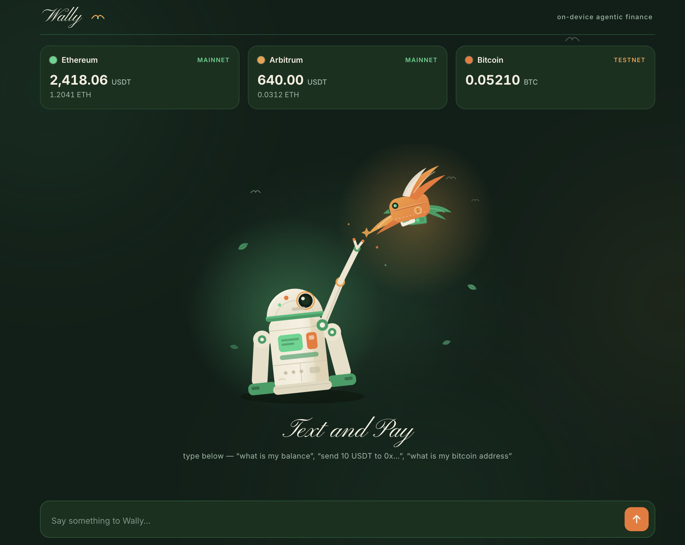

# Wally

A crypto wallet you talk to. The AI runs on your machine. The keys never leave it either.



You type plain English. Wally understands it with a local model, quotes the fee, asks you to confirm, and executes on-chain. No cloud AI, no API keys, no custodian.

- **USDT in, USDT out, fees in USDT.** Wally's home chain is Arbitrum with an ERC-4337 smart account: you hold USDT, you send USDT, and the network fee is paid in USDT. The wallet never needs to hold ETH. ([setup](GASLESS.md))
- **Local intelligence.** [QVAC](https://qvac.tether.io), Tether's on-device AI runtime, runs a quantized Qwen3 4B on your laptop. Your messages never leave the machine to be understood.
- **Local keys.** [WDK](https://wdk.tether.io), Tether's Wallet Development Kit, derives your wallet from a seed phrase and signs locally. Only signed transactions touch the network.
- **A human gate on every spend.** The AI proposes a transaction. Nothing moves until you press CONFIRM inside a 60 second window.

## Run it in five minutes

**You need:** Node.js 22+, and [QVAC](https://qvac.tether.io) installed with a downloaded model (Qwen3 4B or larger).

```bash
git clone https://github.com/victorchimakanu/wally.git
cd wally
npm install
cp .env.example .env.local
```

**Create your wallet.** Wally has no wallet until you give it a seed phrase. Generate a fresh one:

```bash
node -e "console.log(require('ethers').Wallet.createRandom().mnemonic.phrase)"
```

Open `.env.local` and set two values:

```bash
QVAC_MODEL_ID=/Users/you/.qvac/models/your-model.gguf   # path to your local model file
WDK_SEED=the twelve words you just generated
```

Start it:

```bash
npm run dev
```

Open [http://localhost:3000](http://localhost:3000). The first message takes a few extra seconds while the model loads.

**To send USDT without ever touching ETH** (the intended Wally experience), do the ten minute [gasless setup](GASLESS.md): one JSON config file with a free bundler/paymaster key, and two lines in `.env.local`. Your Arbitrum wallet becomes a smart account that pays its fees in USDT.

## Your wallet is yours, not this repo's

The repo contains code, no keys. Every address Wally shows is derived from the seed in **your** local `.env.local`, which is gitignored. Nobody who clones this repo can see or touch your wallet, and you cannot touch theirs. There is no shared example wallet.

That also means:

- **Write the twelve words down.** The seed is the wallet. Lose it and the funds are unrecoverable; anyone who has it has your money.
- **Receiving:** click any balance card to reveal and copy that chain's address. Anyone can send funds to it, even while the app is closed.
- **Start on testnet.** `NETWORK_MODE=testnet` is the default. Switch to `mainnet` in `.env.local` only when you mean it, and fund the wallet with small amounts first.
- **Skip ETH.** With the [gasless smart account](GASLESS.md) enabled, USDT is the only asset you ever need on Arbitrum. Without it, classic accounts need a little ETH on the same chain for gas, which is exactly the annoyance Wally exists to remove.

## Talk to it

```text
what is my balance
what is my arbitrum address
send 10 USDT to 0x... on arbitrum
```

Chats are saved on your device in a local SQLite file and appear in the sidebar. Nothing syncs anywhere.

## How it works

```text
your sentence
   -> sanitize            prompt injection screening
   -> QVAC (local LLM)    intent parsing, output locked to a JSON schema
   -> agent               strict validation; recipient taken from your literal text
   -> quote               WDK estimates the fee
   -> CONFIRM             a human presses the button, or nothing happens
   -> WDK (subprocess)    signs locally, broadcasts
   -> verify              success is only claimed once the chain confirms it
```

The full documentation site ships in this repo, in the same Wally theme, with the working code inlined:

```bash
cd docs-site && npm install && npm run start   # http://localhost:3001
```

It covers the QVAC and WDK architecture, the full transaction lifecycle, why on-device signing matters, the gasless setup, and the LoRA fine-tuning roadmap (a wallet that learns how you talk about money, trained on your device).

## Project layout

```text
src/qvac/       local inference: model loading, schema-constrained parsing
src/wdk/        the wallet subprocess: MCP client, tools, on-chain verification
src/agent/      the bridge: sanitize -> parse -> validate -> confirm -> execute -> verify
src/session/    chat sessions, SQLite persistence
public/         the UI (plain HTML/CSS/JS, no build step)
docs-site/      the documentation site
```

Tests: `npm test`. Type check: `npm run typecheck`.

## Built on

[QVAC](https://qvac.tether.io) local AI runtime · [WDK](https://wdk.tether.io) Wallet Development Kit · Fastify + WebSocket · SQLite

Wally is a reference app. Read it, run it, copy the pattern.
